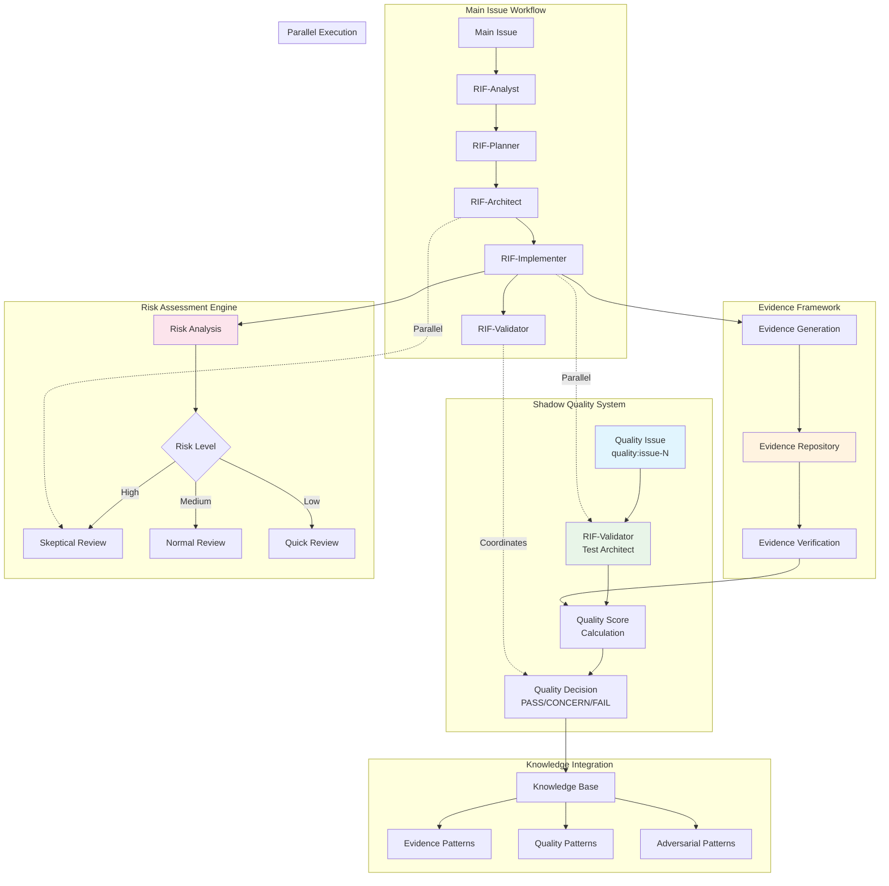
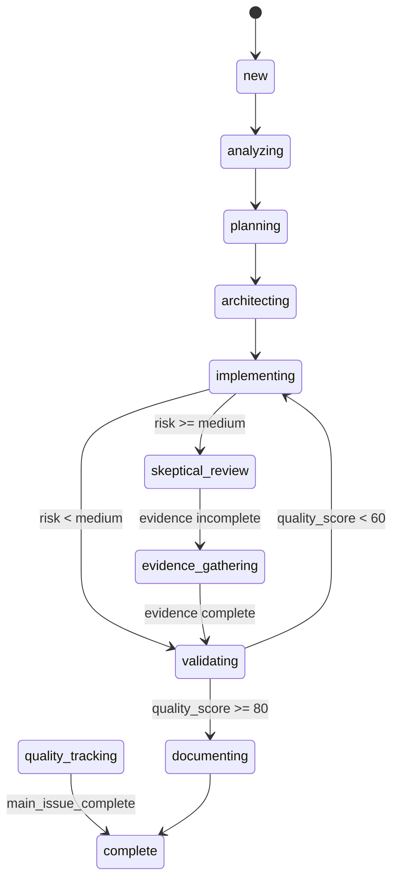

# RIF Adversarial Verification System Architecture

## Overview

This document defines the technical architecture for Issue #16: Enhance RIF Verification with Adversarial Testing Approach. The system transforms existing RIF validation from trust-based to evidence-based adversarial verification to achieve 0% false positive completion rates.

## System Architecture



## Core Components

### 1. Enhanced RIF-Validator (Test Architect)

**Identity Transformation**: Professional "Test Architect with Quality Advisory Authority"

**Key Responsibilities**:
- Evidence-based verification of all completion claims
- Risk assessment and automatic escalation
- Quality score calculation using deterministic formula
- Shadow quality issue management
- Adversarial testing coordination

**Evidence Requirements Matrix**:

| Completion Type | Mandatory Evidence | Verification Method | Threshold |
|----------------|-------------------|-------------------|-----------|
| Feature Complete | Unit tests + Integration tests + Coverage report | Automated test execution | All pass, >80% coverage |
| Bug Fixed | Regression test + Root cause analysis + Fix verification | Test execution + Documentation review | Regression test passes |
| Performance Improved | Baseline + Current metrics + Analysis | Benchmark comparison | Measurable improvement |

### 2. Shadow Quality Tracking System

**Architecture**:
- Parallel `quality:issue-{number}` issues for independent quality assessment
- Continuous quality monitoring throughout main issue lifecycle
- Independent audit trail for all quality decisions
- Parallel orchestration opportunities for RIF-Validator

**Quality Issue Lifecycle**:
```
Main Issue Created → Quality Issue Auto-Created → Continuous Monitoring → Quality Assessment → Shadow Issue Closed
```

### 3. Evidence Framework

**Evidence Collection Process**:
1. **RIF-Implementer**: Generates evidence during implementation
2. **Evidence Repository**: Centralized storage and indexing
3. **RIF-Validator**: Verifies evidence completeness and validity
4. **Quality Scoring**: Deterministic calculation based on evidence

**Evidence Types**:
- **Test Evidence**: Unit, integration, E2E test results
- **Coverage Evidence**: Code coverage reports and analysis
- **Performance Evidence**: Benchmark results and comparisons
- **Security Evidence**: Security scan results and assessments
- **Documentation Evidence**: Complete technical documentation

### 4. Risk Assessment Engine

**Automatic Risk Detection Triggers**:
- Security/auth/payment files modified
- Large diffs (>500 lines)
- No tests added with implementation
- Previous validation failures
- High complexity indicators

**Risk Levels and Response**:
- **Low Risk**: Quick verification, standard evidence
- **Medium Risk**: Normal verification, full evidence suite
- **High Risk**: Skeptical review, enhanced evidence, adversarial testing
- **Critical Risk**: Deep verification, security review, multiple validators

### 5. Deterministic Quality Scoring

**Formula**: `Quality Score = 100 - (20 × FAIL_COUNT) - (10 × CONCERN_COUNT)`

**Decision Matrix**:
- **PASS** (≥80): All quality gates met, ready for completion
- **CONCERNS** (60-79): Minor issues, may proceed with monitoring
- **FAIL** (<60): Significant issues, must return to implementation
- **WAIVED** (Any score): Manual override with documented rationale

## Parallel Execution Architecture

### States and Transitions



### Parallel Execution Rules

1. **Shadow Quality Tracking**: Runs parallel to entire main issue lifecycle
2. **Skeptical Review**: Can run parallel to implementing/architecting for high-risk changes
3. **Evidence Gathering**: Sequential after skeptical review identifies gaps
4. **Resource Isolation**: Parallel states don't conflict or block each other

## Integration Specifications

### Workflow Engine Integration

**New States Added**:
- `skeptical_review`: Adversarial verification with evidence focus
- `evidence_gathering`: Collecting proof for validation claims
- `quality_tracking`: Continuous shadow quality monitoring

**Transition Logic**:
- Risk-based routing to appropriate verification depth
- Evidence-driven progression through quality states
- Parallel execution coordination

### GitHub Integration

**Automatic Shadow Issue Creation**:
- Pattern: `quality:issue-{main_issue_number}`
- Auto-labels: `quality-tracking`, `continuous-monitoring`
- Assignment: RIF-Validator agent
- Lifecycle: Matches main issue progression

**Quality Comments**:
- Evidence summaries
- Quality scores with breakdown
- Risk assessment results
- Recommendations and next steps

### Knowledge Base Integration

**Pattern Storage**:
- Successful evidence collection approaches
- Effective adversarial testing techniques
- Quality gate configurations that work
- Risk assessment pattern effectiveness

**Continuous Learning**:
- Quality score trends and effectiveness
- Evidence requirement calibration
- Process improvement opportunities
- Adversarial technique refinement

## Technical Implementation Details

### Evidence Storage Schema

```json
{
  "issue_id": "16",
  "evidence_type": "feature_complete",
  "evidence": {
    "tests": {
      "unit_tests": { "passed": 142, "failed": 0, "coverage": "94%" },
      "integration_tests": { "passed": 38, "failed": 0 },
      "e2e_tests": { "passed": 15, "failed": 0 }
    },
    "security": { "scan_results": "no_critical_vulnerabilities" },
    "performance": { "baseline": "120ms", "current": "115ms", "improvement": "4%" }
  },
  "verification_status": "verified",
  "quality_score": 95,
  "timestamp": "2025-08-23T12:00:00Z"
}
```

### Risk Assessment Algorithm

```python
def calculate_risk_level(changes):
    risk_score = 0
    
    # File-based risk assessment
    if any(path.match("**/security/**") for path in changes.files):
        risk_score += 40
    if any(path.match("**/auth/**") for path in changes.files):
        risk_score += 40
    if any(path.match("**/payment/**") for path in changes.files):
        risk_score += 50
    
    # Size-based risk assessment
    if changes.lines_modified > 500:
        risk_score += 30
    elif changes.lines_modified > 100:
        risk_score += 15
    
    # Test coverage risk
    if not changes.has_new_tests:
        risk_score += 25
    
    # Determine risk level
    if risk_score >= 70: return "critical"
    elif risk_score >= 50: return "high"  
    elif risk_score >= 25: return "medium"
    else: return "low"
```

### Quality Score Calculation

```python
def calculate_quality_score(evidence):
    base_score = 100
    fail_count = sum(1 for item in evidence if item.status == "FAIL")
    concern_count = sum(1 for item in evidence if item.status == "CONCERN")
    
    quality_score = base_score - (20 * fail_count) - (10 * concern_count)
    
    return max(0, quality_score)  # Minimum score is 0

def determine_quality_decision(score):
    if score >= 80: return "PASS"
    elif score >= 60: return "CONCERNS" 
    else: return "FAIL"
```

## Performance Specifications

### Resource Requirements

- **Memory**: <10MB additional for evidence storage per issue
- **CPU**: <5% overhead for risk assessment and quality scoring
- **Network**: Minimal impact, primarily GitHub API calls
- **Storage**: ~1MB per issue for comprehensive evidence

### Performance Targets

- **Risk Assessment**: <100ms per change analysis
- **Evidence Verification**: <2s per evidence item
- **Quality Score Calculation**: <50ms per calculation
- **Shadow Issue Creation**: <500ms per issue
- **Parallel Execution Overhead**: <2% system performance impact

## Security Considerations

### Evidence Integrity

- Cryptographic hashing of evidence items
- Tamper detection for evidence repository
- Audit trail for all evidence modifications
- Secure storage of sensitive evidence data

### Access Control

- Role-based access to quality tracking issues
- Restricted evidence modification permissions
- Secure evidence verification processes
- Audit logging for all quality decisions

## Monitoring and Observability

### Quality Metrics

- False positive completion rate (target: 0%)
- Evidence coverage completeness (target: 100%)
- Quality score trends and distributions
- Risk assessment accuracy
- Parallel execution performance

### Alerting

- Critical quality failures
- Evidence verification errors
- Risk assessment escalations
- Shadow issue creation failures
- Performance degradation

## Future Extensibility

### Planned Enhancements

- Machine learning for risk assessment improvement
- Automated adversarial test generation
- Evidence pattern recommendation engine
- Quality trend prediction and alerting
- Integration with external quality tools

### Extension Points

- Custom evidence types for domain-specific requirements
- Pluggable risk assessment criteria
- Configurable quality scoring formulas
- Custom adversarial testing strategies
- Integration with CI/CD quality gates

## Conclusion

This architecture provides a comprehensive solution for transforming RIF validation from trust-based to evidence-based adversarial verification. The design maintains backward compatibility while introducing powerful new capabilities for ensuring quality and preventing false positive completions.

The parallel execution model enables quality work to proceed alongside implementation, maintaining development velocity while dramatically improving quality outcomes. The shadow quality tracking system provides complete audit trails and independent quality assessment.

Through deterministic quality scoring, risk-based verification depth, and comprehensive evidence requirements, this system achieves the goal of 0% false positive completion rates while maintaining the efficiency and automation that makes RIF effective.