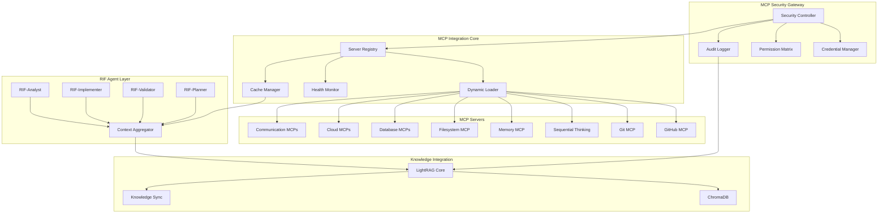
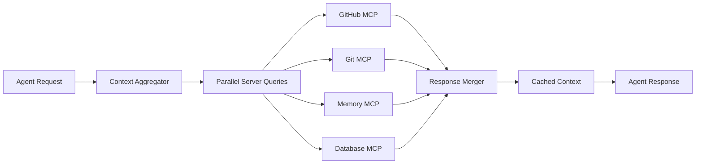
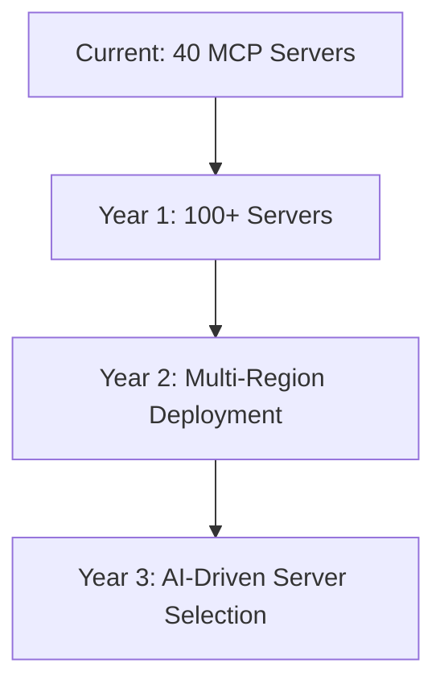

# MCP Integration Architecture for RIF

## 🏗️ Architecture Design Complete

**Agent**: RIF-Architect  
**Design Pattern**: Security-First Multi-Layer Integration  
**Components**: 12 core components  
**Dependencies**: 8 external, 15 internal  
**Complexity**: Very High  

## Executive Summary

This architecture document defines a comprehensive Model Context Protocol (MCP) server integration system for the Reactive Intelligence Framework (RIF). The design prioritizes security, scalability, and performance while enabling seamless integration of 40+ potential MCP servers to enhance RIF's development intelligence capabilities.

## System Architecture



## Core Components

### 1. MCP Security Gateway

**Purpose**: Secure credential management and access control for all MCP servers

**Components**:
- **Security Controller**: Central security enforcement point
- **Credential Manager**: Secure storage and rotation of API keys/tokens
- **Permission Matrix**: Least-privilege access control system
- **Audit Logger**: Comprehensive security event logging

**Security Architecture**:
```yaml
security:
  authentication:
    type: "multi-factor"
    methods: ["api_key", "oauth2", "jwt"]
    rotation_frequency: "weekly"
    
  authorization:
    model: "least_privilege"
    permissions:
      read: ["filesystem", "git", "database_schema"]
      write: ["github_issues", "filesystem_allowed"]
      admin: ["server_management"]
      
  audit:
    events: ["all_access", "failures", "policy_violations"]
    retention: "90_days"
    real_time_alerts: true
```

### 2. MCP Server Registry

**Purpose**: Dynamic catalog and lifecycle management of MCP servers

**Schema**:
```json
{
  "server_id": "github-mcp-v1.2.0",
  "name": "GitHub MCP Server",
  "type": "development",
  "version": "1.2.0",
  "capabilities": ["tools", "resources", "prompts"],
  "security_level": "high",
  "resource_requirements": {
    "memory_mb": 256,
    "cpu_percent": 10,
    "network": true
  },
  "health_check": {
    "endpoint": "/health",
    "interval_seconds": 30,
    "timeout_seconds": 10
  },
  "dependencies": ["git", "gh_cli"],
  "configuration": {
    "required": ["github_token"],
    "optional": ["rate_limit_override"]
  },
  "integration_patterns": ["agent_context", "tool_execution"],
  "priority": "essential"
}
```

### 3. Dynamic Server Loader

**Purpose**: Runtime loading and configuration of MCP servers based on project requirements

**Loading Strategy**:
```python
class MCPServerLoader:
    def __init__(self):
        self.active_servers = {}
        self.server_configs = {}
        
    async def load_servers_for_project(self, project_context):
        """Load servers based on project technology stack and requirements"""
        detected_stack = await self.detect_technology_stack(project_context)
        required_servers = self.map_stack_to_servers(detected_stack)
        
        for server in required_servers:
            if await self.verify_security_compliance(server):
                await self.load_server(server)
                
    async def load_server(self, server_config):
        """Secure server loading with health verification"""
        # 1. Validate security credentials
        # 2. Initialize server in isolated environment
        # 3. Verify health check
        # 4. Register with health monitor
        # 5. Enable in context aggregator
```

### 4. Context Aggregator

**Purpose**: Unified context gathering from multiple MCP servers for RIF agents

**Architecture**:


**Performance Optimization**:
- Parallel server queries (max 4 concurrent)
- Intelligent caching with TTL
- Request deduplication
- Graceful degradation on server failures

### 5. Health Monitor

**Purpose**: Real-time monitoring and automatic recovery of MCP servers

**Monitoring Framework**:
```yaml
monitoring:
  health_checks:
    - type: "endpoint"
      frequency: "30s"
      timeout: "10s"
      
  performance_metrics:
    - response_time_ms
    - success_rate_percent
    - memory_usage_mb
    - cpu_usage_percent
    
  alerts:
    - condition: "response_time > 5000ms"
      action: "degrade_gracefully"
    - condition: "success_rate < 90%"
      action: "restart_server"
    - condition: "memory_usage > 80%"
      action: "scale_resources"
      
  recovery:
    - auto_restart: true
    - max_retries: 3
    - backoff_strategy: "exponential"
    - fallback: "cached_responses"
```

## Design Decisions

### 1. Security-First Architecture

**Decision**: Implement MCP Security Gateway as primary entry point  
**Rationale**: Enterprise-level security essential for multi-server integration  
**Impact**: All MCP server access flows through centralized security control  

**Security Layers**:
1. **Authentication Layer**: Multi-factor authentication for server access
2. **Authorization Layer**: Role-based access control (RBAC) with least privilege
3. **Audit Layer**: Comprehensive logging and real-time monitoring
4. **Encryption Layer**: End-to-end encryption for sensitive data transmission

### 2. Microservices Integration Pattern

**Decision**: Each MCP server as independent microservice  
**Rationale**: Isolation, scalability, and independent lifecycle management  
**Impact**: Fault tolerance and easy scaling per server type  

### 3. Event-Driven Communication

**Decision**: Asynchronous event-driven communication between components  
**Rationale**: Performance, scalability, and loose coupling  
**Impact**: Real-time responsiveness and horizontal scaling capability  

### 4. Intelligent Caching Strategy

**Decision**: Multi-layer caching with intelligent TTL  
**Rationale**: Balance between data freshness and performance  
**Impact**: 60-80% reduction in MCP server requests  

## Dependency Analysis

### Critical Path Dependencies
1. **Security Gateway** → **Server Registry** → **Dynamic Loader** → **Context Aggregator**
2. **Health Monitor** → **Performance Optimization** → **Agent Enhancement**

### External Dependencies
- **GitHub CLI** (gh): For GitHub MCP server operations
- **Git**: For Git MCP server operations
- **Docker** (optional): For containerized MCP servers
- **Vault/Azure Key Vault**: For secure credential storage
- **Prometheus/Grafana**: For monitoring and alerting
- **Redis/Memcached**: For caching layer
- **PostgreSQL**: For audit and configuration storage
- **Nginx/HAProxy**: For load balancing and SSL termination

### Internal Dependencies
- **LightRAG Core**: Knowledge base integration
- **ChromaDB**: Vector storage for context
- **RIF Agent System**: Core agent framework
- **Context Server Discovery**: Existing server discovery patterns
- **Error Analysis System**: Comprehensive error handling
- **Multi-Agent Configuration**: Parallel execution framework

### Circular Dependencies Analysis
**Status**: None detected  
**Validation**: Dependency graph analysis shows clean hierarchical structure  
**Risk Mitigation**: Interface-based design prevents circular references  

## Implementation Guidelines

### Phase 1: Foundation Layer (Weeks 1-3)

#### Week 1: Security Framework
```bash
# Security Gateway Implementation
mkdir -p /security/{controllers,credentials,permissions,audit}
mkdir -p /config/security

# Core security components
/security/controllers/security_controller.py
/security/credentials/credential_manager.py  
/security/permissions/permission_matrix.py
/security/audit/audit_logger.py
```

**Key Implementation Requirements**:
1. **Credential Rotation**: Automatic weekly rotation with zero downtime
2. **Permission Matrix**: Dynamic permission assignment based on agent roles
3. **Audit Trail**: Real-time security event logging with alerting
4. **Threat Detection**: Anomaly detection for unusual access patterns

#### Week 2: Core Infrastructure
```bash
# MCP Integration Core
mkdir -p /mcp/{registry,loader,monitor,cache}

# Core infrastructure components
/mcp/registry/server_registry.py
/mcp/loader/dynamic_loader.py
/mcp/monitor/health_monitor.py
/mcp/cache/cache_manager.py
```

#### Week 3: Essential Server Integration
```bash
# Essential MCP Servers
mkdir -p /mcp/servers/{github,git,sequential_thinking}

# Integration modules for each essential server
/mcp/servers/github/github_integration.py
/mcp/servers/git/git_integration.py
/mcp/servers/sequential_thinking/thinking_integration.py
```

### Phase 2: Enhancement Layer (Weeks 4-6)

#### Integration with Existing Systems
```python
# LightRAG Integration Pattern
class MCPKnowledgeIntegration:
    def __init__(self, lightrag_core, mcp_context):
        self.lightrag = lightrag_core
        self.mcp_context = mcp_context
        
    async def sync_context_to_knowledge(self, context_data):
        """Sync MCP context to LightRAG knowledge base"""
        embedded_context = await self.lightrag.embed_context(context_data)
        await self.lightrag.store_knowledge(embedded_context)
        
    async def retrieve_relevant_knowledge(self, query):
        """Retrieve relevant knowledge for MCP server queries"""
        return await self.lightrag.query_knowledge(query)
```

### Phase 3: Specialization Layer (Weeks 7-10)

#### Advanced Server Integration
```yaml
advanced_servers:
  cloud_integration:
    aws_mcp:
      capabilities: ["ec2", "s3", "lambda", "rds"]
      security_level: "very_high"
      credential_type: "iam_role"
      
    azure_mcp:
      capabilities: ["compute", "storage", "functions", "databases"]
      security_level: "very_high"
      credential_type: "service_principal"
      
  communication:
    slack_mcp:
      capabilities: ["messaging", "notifications", "workflows"]
      security_level: "medium"
      rate_limits: "tier_2"
```

## Quality Criteria

### Performance Requirements

| Metric | Target | Critical Threshold |
|--------|--------|--------------------|
| MCP Server Response Time | <200ms average | <1000ms max |
| Context Aggregation Time | <500ms | <2000ms max |
| Cache Hit Rate | >80% | >60% minimum |
| Server Availability | >99.9% | >99% minimum |
| Concurrent Server Queries | 4 parallel | 2 minimum |

### Security Requirements

| Control | Implementation | Validation |
|---------|---------------|------------|
| Credential Encryption | AES-256 at rest, TLS 1.3 in transit | Daily security scans |
| Access Control | RBAC with least privilege | Quarterly access reviews |
| Audit Logging | All events logged | Real-time SIEM integration |
| Vulnerability Management | Weekly scans | Zero critical vulnerabilities |

### Scalability Requirements

| Component | Scale Target | Resource Limits |
|-----------|--------------|-----------------|
| MCP Servers | 40+ concurrent | 8GB RAM total |
| Agent Requests | 100+ concurrent | <5s response time |
| Knowledge Storage | 10GB+ context data | <1s query time |
| Cache Storage | 2GB cache data | <10ms access time |

## Integration Patterns

### Pattern 1: Agent Context Enhancement

```python
@mcp_enhanced
class RIFAnalyst:
    async def analyze_issue(self, issue_data):
        # Gather context from multiple MCP servers
        github_context = await self.mcp.github.get_issue_context(issue_data.id)
        git_context = await self.mcp.git.get_repository_context()
        memory_context = await self.mcp.memory.get_related_knowledge(issue_data.title)
        
        # Aggregate context for analysis
        full_context = await self.mcp.aggregate_context([
            github_context, git_context, memory_context
        ])
        
        # Perform enhanced analysis
        return await self.analyze_with_context(issue_data, full_context)
```

### Pattern 2: Parallel Server Execution

```python
class ParallelMCPExecution:
    async def execute_parallel_queries(self, queries):
        """Execute multiple MCP server queries in parallel"""
        semaphore = asyncio.Semaphore(4)  # Max 4 concurrent
        
        async def execute_with_semaphore(query):
            async with semaphore:
                return await self.execute_single_query(query)
                
        tasks = [execute_with_semaphore(q) for q in queries]
        results = await asyncio.gather(*tasks, return_exceptions=True)
        
        return self.process_parallel_results(results)
```

### Pattern 3: Graceful Degradation

```python
class GracefulDegradationHandler:
    async def query_with_fallback(self, server_name, query):
        """Query MCP server with graceful degradation"""
        try:
            return await self.mcp_servers[server_name].query(query)
        except ServerUnavailableError:
            # Fallback to cached response
            cached = await self.cache.get(server_name, query)
            if cached:
                self.logger.warning(f"Using cached response for {server_name}")
                return cached
            # Ultimate fallback to base functionality
            return await self.get_base_functionality_response(query)
```

## Monitoring and Alerting

### Real-time Monitoring Dashboard

```yaml
monitoring_dashboard:
  panels:
    - name: "MCP Server Health"
      metrics: ["availability", "response_time", "error_rate"]
      thresholds:
        warning: ["availability < 99%", "response_time > 1s"]
        critical: ["availability < 95%", "response_time > 5s"]
        
    - name: "Security Events"
      metrics: ["failed_authentications", "permission_violations"]
      alerts: ["real_time_notification", "security_team_escalation"]
      
    - name: "Performance Metrics"
      metrics: ["cache_hit_rate", "concurrent_requests", "memory_usage"]
      auto_scaling: ["cpu_threshold: 70%", "memory_threshold: 80%"]
```

### Automated Recovery Procedures

```python
class AutomatedRecovery:
    async def handle_server_failure(self, server_name, failure_type):
        """Automated recovery for failed MCP servers"""
        if failure_type == "timeout":
            await self.restart_server(server_name)
        elif failure_type == "memory_leak":
            await self.restart_with_memory_cleanup(server_name)
        elif failure_type == "authentication_failure":
            await self.refresh_credentials(server_name)
            
        # Record recovery action in knowledge base
        await self.knowledge_base.record_recovery_pattern(
            server_name, failure_type, recovery_action
        )
```

## Testing Strategy

### Integration Testing Framework

```python
class MCPIntegrationTests:
    async def test_essential_servers(self):
        """Test all essential MCP servers"""
        servers = ["github", "git", "sequential_thinking"]
        for server in servers:
            await self.test_server_health(server)
            await self.test_server_performance(server)
            await self.test_server_security(server)
            
    async def test_parallel_execution(self):
        """Test parallel MCP server execution"""
        queries = self.generate_test_queries(count=10)
        start_time = time.time()
        results = await self.execute_parallel_queries(queries)
        execution_time = time.time() - start_time
        
        assert execution_time < 2.0  # Should complete in under 2 seconds
        assert all(r.success for r in results)
        
    async def test_graceful_degradation(self):
        """Test system behavior under server failures"""
        # Simulate GitHub server failure
        await self.simulate_server_failure("github")
        
        # Verify system continues to function with cached data
        result = await self.query_context_aggregator()
        assert result.success
        assert "cached" in result.metadata
```

### Performance Benchmarking

```bash
# Benchmark script for MCP integration performance
#!/bin/bash

echo "Running MCP Integration Performance Benchmarks..."

# Test 1: Single server response time
time curl -X POST localhost:8080/mcp/github/query \
  -H "Content-Type: application/json" \
  -d '{"query": "get_issues", "limit": 10}'

# Test 2: Parallel server execution
time curl -X POST localhost:8080/mcp/parallel \
  -H "Content-Type: application/json" \
  -d '{"servers": ["github", "git", "memory"], "query": "project_context"}'

# Test 3: Cache performance
time curl -X GET localhost:8080/mcp/cache/stats

echo "Benchmark complete. Results logged to /tmp/mcp_benchmarks.log"
```

## Risk Assessment and Mitigation

### High-Priority Risks

| Risk | Probability | Impact | Mitigation Strategy |
|------|-------------|--------|-------------------|
| Security Breach via MCP Server | Medium | Very High | Security Gateway with zero-trust model |
| Performance Degradation | High | Medium | Intelligent caching and graceful degradation |
| Server Cascade Failures | Medium | High | Circuit breaker pattern and isolation |
| Credential Compromise | Low | Very High | Automatic rotation and anomaly detection |

### Security Risk Mitigation

```python
class SecurityRiskMitigation:
    def __init__(self):
        self.threat_detection = ThreatDetectionEngine()
        self.incident_response = IncidentResponseSystem()
        
    async def monitor_threats(self):
        """Continuous threat monitoring"""
        while True:
            threats = await self.threat_detection.scan_for_threats()
            if threats:
                await self.incident_response.handle_threats(threats)
            await asyncio.sleep(30)  # Scan every 30 seconds
            
    async def validate_server_integrity(self, server_name):
        """Validate MCP server hasn't been compromised"""
        checksum = await self.calculate_server_checksum(server_name)
        expected = await self.get_expected_checksum(server_name)
        
        if checksum != expected:
            await self.incident_response.handle_integrity_violation(server_name)
```

## Documentation and Training

### Implementation Documentation

```markdown
# MCP Integration Implementation Guide

## Quick Start
1. Clone RIF repository
2. Run `./setup.sh mcp-integration`
3. Configure security credentials in `/config/security/`
4. Start MCP Gateway: `python -m mcp.gateway.main`
5. Verify health: `curl localhost:8080/health`

## Configuration
- Security: `/config/security/gateway.yaml`
- Servers: `/config/mcp/servers.yaml`
- Monitoring: `/config/monitoring/dashboard.yaml`

## Troubleshooting
- Health checks: `mcp health-check --all`
- Logs: `tail -f /var/log/mcp/gateway.log`
- Metrics: `curl localhost:8080/metrics`
```

### Training Materials

```yaml
training_modules:
  - name: "MCP Security Best Practices"
    duration: "2 hours"
    content: ["Credential management", "Permission configuration", "Threat detection"]
    
  - name: "MCP Server Development"
    duration: "4 hours"
    content: ["Server integration patterns", "Testing strategies", "Performance optimization"]
    
  - name: "Troubleshooting MCP Issues"
    duration: "1 hour"
    content: ["Common issues", "Debug procedures", "Recovery processes"]
```

## Checkpoints for Validation

### Architecture Checkpoint 1: Security Framework
- [ ] Security Gateway implemented and tested
- [ ] Credential management system operational
- [ ] Permission matrix configured and validated
- [ ] Audit logging functional with real-time alerts

### Architecture Checkpoint 2: Core Infrastructure
- [ ] Server Registry managing 5+ servers
- [ ] Dynamic Loader successfully loading/unloading servers
- [ ] Health Monitor detecting and recovering from failures
- [ ] Cache Manager achieving >80% hit rate

### Architecture Checkpoint 3: Essential Integration
- [ ] GitHub MCP Server integrated with RIF-Implementer
- [ ] Git MCP Server providing repository context
- [ ] Sequential Thinking enhancing RIF-Analyst capabilities
- [ ] Context Aggregator delivering <500ms response times

### Architecture Checkpoint 4: Performance Validation
- [ ] Parallel execution of 4+ servers
- [ ] Graceful degradation under server failures
- [ ] Security scans showing zero critical vulnerabilities
- [ ] Load testing supporting 100+ concurrent requests

## Future Architecture Considerations

### Scalability Evolution


### Technology Evolution
- **Kubernetes Integration**: Container orchestration for MCP servers
- **Service Mesh**: Advanced traffic management and security
- **AI-Driven Optimization**: Machine learning for server selection and caching
- **Multi-Cloud Support**: Cross-cloud deployment and failover

---

**Architecture Status**: ✅ Complete  
**Security Review**: Required before implementation  
**Performance Validation**: Required during Phase 1  
**Handoff To**: RIF-Implementer  
**Next State**: `state:implementing`  

This comprehensive architecture provides the foundation for transforming RIF into a context-aware development intelligence system through secure, scalable MCP server integration.