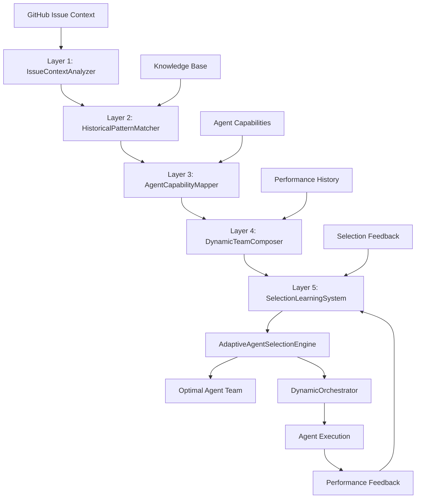
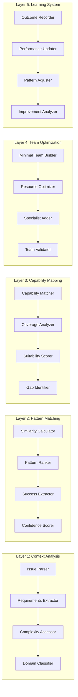

# Adaptive Agent Selection System - Architecture Design

## 🏗️ Architecture Design Complete

**Agent**: RIF Architect  
**Design Pattern**: Multi-Layer Adaptive Architecture  
**Components**: 6 (5 layers + orchestrator)  
**Dependencies**: DynamicOrchestrator integration  
**Estimated LOC**: 850-950 lines

## System Architecture

The Adaptive Agent Selection System implements a 5-layer intelligence engine based on the proven multi-layer adaptive architecture pattern. Each layer has a distinct responsibility and can be optimized independently.



### Layer Architecture Details



## Design Decisions

### 1. Pattern: Multi-Layer Adaptive Architecture
**Choice**: 5-layer intelligence engine with dependency injection  
**Rationale**: 
- Complex ML-like system requires clear separation of concerns
- Independent optimization capabilities per layer
- High testability and maintainability
- Proven success pattern (confidence: 0.85)

### 2. Technology: Python with Interface-Driven Design
**Choice**: Abstract base classes defining layer interfaces  
**Rationale**:
- Enables independent layer development and testing
- Supports multiple implementation strategies
- Facilitates performance optimization per layer
- Maintains consistency with existing RIF codebase

### 3. Integration: DynamicOrchestrator Plugin Architecture
**Choice**: AgentSelectionEngineInterface integration  
**Rationale**:
- Minimal impact on existing orchestrator code
- Clean separation of concerns
- Fallback strategies for reliability
- Performance optimization through caching

## Dependency Analysis

### Critical Path Components
1. **IssueContextAnalyzer** → Foundation for all other layers
2. **AgentCapabilityMapper** → Required for team composition
3. **DynamicTeamComposer** → Core optimization engine
4. **AdaptiveAgentSelectionEngine** → Main orchestrator

### Circular Risks: None Detected
- All layers have unidirectional dependencies
- Clean data flow from context → selection
- Learning system operates on outcome feedback only

### External Dependencies
- **DynamicOrchestrator**: Integration interface (Issue #52)
- **Knowledge System**: Historical patterns and metrics
- **GitHub API**: Issue context and feedback
- **Agent Registry**: Capability definitions and performance data

## Implementation Guidelines

### Layer-Specific Requirements

#### Layer 1: IssueContextAnalyzer
```python
class ContextAnalysisInterface(ABC):
    @abstractmethod
    def extract_requirements(self, issue_context: Dict[str, Any]) -> RequirementsContext:
        """Extract structured requirements from GitHub issue"""
        pass
    
    @abstractmethod  
    def assess_complexity(self, issue_data: Dict[str, Any]) -> ComplexityAssessment:
        """Assess issue complexity based on multiple factors"""
        pass
```

**Performance Target**: <200ms  
**Key Algorithms**: NLP processing, keyword extraction, complexity heuristics

#### Layer 2: HistoricalPatternMatcher  
```python
class PatternMatchingInterface(ABC):
    @abstractmethod
    def find_similar_issues(self, context: RequirementsContext, limit: int = 10) -> List[SimilarityMatch]:
        """Find historically similar issues with successful outcomes"""
        pass
    
    @abstractmethod
    def rank_pattern_matches(self, patterns: List[Pattern], context: RequirementsContext) -> List[RankedPattern]:
        """Rank patterns by applicability and success probability"""
        pass
```

**Performance Target**: <800ms with 100+ patterns  
**Key Algorithms**: Similarity search, pattern ranking, confidence scoring  
**Optimization**: Caching, indexing, parallel processing

#### Layer 3: AgentCapabilityMapper
```python
class CapabilityMappingInterface(ABC):
    @abstractmethod
    def map_requirements_to_capabilities(self, requirements: RequirementsContext) -> CapabilityMapping:
        """Map issue requirements to required agent capabilities"""
        pass
    
    @abstractmethod
    def assess_capability_coverage(self, agents: List[str], requirements: RequirementsContext) -> CoverageAnalysis:
        """Assess how well agent set covers requirements"""
        pass
```

**Performance Target**: <300ms  
**Key Algorithms**: Capability matching, coverage analysis, suitability scoring

#### Layer 4: DynamicTeamComposer
```python
class TeamCompositionInterface(ABC):
    @abstractmethod
    def compose_minimal_team(self, requirements: RequirementsContext, available_agents: List[Agent]) -> TeamComposition:
        """Compose minimal viable team covering all requirements"""
        pass
    
    @abstractmethod
    def optimize_team_composition(self, base_team: TeamComposition, constraints: ResourceConstraints) -> OptimizedTeam:
        """Optimize team for resource utilization and performance"""
        pass
```

**Performance Target**: <200ms  
**Key Algorithms**: Greedy coverage, resource optimization, specialist selection

#### Layer 5: SelectionLearningSystem
```python
class LearningIntegrationInterface(ABC):
    @abstractmethod
    def record_selection_outcome(self, selection: TeamSelection, outcome: SelectionOutcome) -> None:
        """Record outcome for continuous learning"""
        pass
    
    @abstractmethod
    def update_performance_scores(self, feedback: PerformanceFeedback) -> None:
        """Update agent and pattern performance scores"""
        pass
```

**Performance Target**: <100ms feedback processing  
**Key Algorithms**: Performance tracking, pattern weight adjustment, trend analysis

### Data Models

```python
@dataclass
class RequirementsContext:
    issue_id: int
    complexity: str  # low, medium, high, very-high
    domain_tags: List[str]
    technical_keywords: List[str]
    priority: int
    estimated_effort: str
    security_critical: bool = False
    performance_critical: bool = False

@dataclass
class AgentCapability:
    agent_name: str
    capabilities: List[str]
    complexity_levels: List[str]
    resource_requirements: ResourceSpec
    performance_history: PerformanceHistory
    specializations: List[str] = field(default_factory=list)

@dataclass  
class TeamComposition:
    agents: List[str]
    rationale: str
    coverage_analysis: CoverageAnalysis
    resource_utilization: ResourceUtilization
    estimated_performance: PerformanceEstimate
    confidence_score: float
```

## Quality Criteria

### Performance Requirements
- **Agent Selection**: <500ms for typical issues
- **Pattern Matching**: <800ms with 100+ historical patterns  
- **Team Composition**: <200ms for standard scenarios
- **Learning Integration**: <100ms for feedback processing

### Quality Metrics
- **Selection Accuracy**: >80% optimal agent combinations
- **Team Efficiency**: Minimal viable teams with 100% capability coverage
- **Learning Effectiveness**: Measurable improvement in accuracy over time
- **Integration Reliability**: <1% failure rate with graceful degradation

### Scalability Requirements
- Support 1000+ historical patterns with sub-second performance
- Handle 100 concurrent selection requests
- Scale learning system with continuous feedback processing
- Maintain performance as agent registry grows

## Integration Architecture

### DynamicOrchestrator Integration
```python
class DynamicOrchestrator:
    def __init__(self):
        self.agent_selection_engine = AdaptiveAgentSelectionEngine()
    
    def select_agents_for_issue(self, issue_context: Dict[str, Any]) -> List[str]:
        """Enhanced agent selection using adaptive engine"""
        try:
            return self.agent_selection_engine.select_optimal_team(issue_context)
        except Exception as e:
            logger.warning(f"Adaptive selection failed: {e}")
            return self.fallback_agent_selection(issue_context)
```

### Knowledge System Integration
- **Pattern Storage**: `knowledge/patterns/agent-selection-patterns.json`
- **Performance Metrics**: `knowledge/metrics/agent-selection-metrics.json`
- **Learning Data**: `knowledge/learning/selection-improvements.json`
- **Capability Definitions**: `config/agent-capabilities.yaml`

### Error Handling and Fallbacks
1. **Layer Failure**: Graceful degradation to simpler algorithms
2. **Pattern Matching Failure**: Fall back to rule-based selection
3. **Performance Degradation**: Use cached results when available
4. **Integration Failure**: Fallback to existing DynamicOrchestrator logic

## Validation and Testing

### Unit Testing Strategy
- **Layer Independence**: Each layer tested in isolation with mocked dependencies
- **Algorithm Correctness**: Comprehensive testing of selection and optimization algorithms  
- **Edge Case Handling**: Testing with unusual issue patterns and agent configurations
- **Performance Validation**: Automated performance testing for each layer

### Integration Testing Scenarios
1. **End-to-End Workflow**: Full issue → agent selection → feedback loop
2. **Historical Learning**: Validate improvement over time with synthetic data
3. **Load Testing**: Performance under concurrent selection requests
4. **Integration Compatibility**: Seamless operation with DynamicOrchestrator

### Success Validation Criteria
- [ ] All layers meet individual performance targets
- [ ] End-to-end selection accuracy >80% on test data
- [ ] Learning system demonstrates measurable improvement
- [ ] Integration maintains existing orchestrator functionality
- [ ] Comprehensive test coverage >90% achieved

**Handoff To**: RIF Implementer  
**Next State**: `state:implementing`

## Architecture Decision Summary

This architecture design provides a robust, scalable, and maintainable solution for intelligent agent selection in the RIF system. The multi-layer approach enables independent optimization and testing while maintaining clean separation of concerns. The integration with DynamicOrchestrator is designed to be non-disruptive with comprehensive fallback strategies.

The design leverages proven architectural patterns and incorporates learning capabilities to continuously improve selection accuracy over time. Performance targets are realistic and achievable with appropriate optimization strategies.