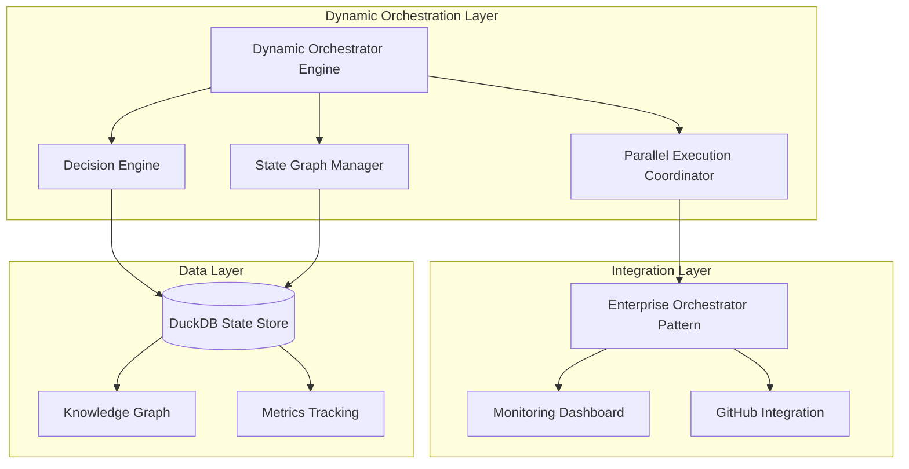

# Dynamic Orchestrator Architecture

## Issue #51: Graph-Based Dynamic Orchestration System

**Agent**: RIF-Architect  
**Design Pattern**: Hybrid Graph-Based State Machine with Evidence-Based Dynamic Routing  
**Components**: 4 core + 3 integration layers  
**Dependencies**: Enterprise Orchestrator Pattern (0.97), Multi-Layer Adaptive Architecture (0.85)

## Executive Summary

This architecture transforms RIF from a linear state machine into an intelligent, graph-based workflow engine that supports non-linear state transitions, adaptive decision-making, and parallel execution paths. The design builds upon the proven Enterprise Orchestrator Pattern while adding sophisticated routing intelligence and loop-back capabilities.

### Key Innovations

1. **Dynamic State Graph**: Any-to-any state transitions based on intelligent decision evaluation
2. **Evidence-Based Routing**: Context-aware decision points with confidence scoring
3. **Adaptive Parallel Execution**: Concurrent workflow paths with resource management
4. **Intelligent Loop-Back**: Smart returns to previous states based on validation results

## Current System Analysis

### Linear Workflow Limitations

The existing `rif-workflow.yaml` defines a primarily linear progression with limited loop-back:

```
new → analyzing → planning → architecting → implementing → validating → learning → complete
```

**Identified Limitations**:
1. **Rigid State Progression**: Limited loop-back to only adjacent or specific states
2. **Binary Decision Points**: Simple trigger/condition pairs without confidence scoring  
3. **Context-Insensitive Routing**: Decisions don't consider full workflow context
4. **Limited Parallel Execution**: Only specific states support parallel execution
5. **No Adaptive Learning**: No mechanism to improve routing decisions over time

### Transition Analysis

Current workflow has 28 state transitions, but most follow linear progression:
- **Forward Progression**: 18 transitions (64%)
- **Loop-Back Transitions**: 6 transitions (21%) - mostly validation → implementation
- **Recovery Transitions**: 4 transitions (14%)

**Gap Analysis**:
- No direct analysis ← validation loop-back for requirement clarification
- No planning ← validation route for strategic reconsideration
- Limited context-aware decision making
- No parallel validation during implementation

## System Architecture

### Component Overview


┌─────────────────────────────────────────────────────────────────────┐
│              Enhanced Orchestrator State Persistence                │
└─────────────────────────────────────────────────────────────────────┘
         ▲                                                   ▲
         │                                                   │
         ▼                                                   ▼
┌─────────────────┐                                ┌─────────────────┐
│    Monitoring   │                                │     GitHub      │
│    Dashboard    │                                │   Integration   │
└─────────────────┘                                └─────────────────┘
```

## Core Components Design

### 1. State Graph Manager

**Responsibility**: Manage dynamic state graph structure and intelligent transition rules

**Key Features**:
- **Flexible State Graph**: Support any-to-any state transitions based on conditions
- **Dynamic Rule Engine**: Runtime modification of transition rules and conditions
- **Graph Validation**: Ensure state graph consistency and prevent infinite loops
- **Performance Optimization**: In-memory graph with persistent backing store

**State Graph Structure**:
```yaml
states:
  analyzing:
    type: analysis_state
    agents: [rif-analyst]
    transitions: [planning, implementing, architecting, analyzing]
    decision_logic: complexity_based_routing + requirement_completeness_check
    loop_back_conditions: [requirements_unclear, validation_failed_analysis]
    
  implementing:
    type: execution_state  
    agents: [rif-implementer]
    transitions: [validating, architecting, analyzing]
    decision_logic: code_completion_check + quality_prerequisites
    loop_back_conditions: [architectural_issues, requirements_misunderstood]
    
  validating:
    type: verification_state
    agents: [rif-validator] 
    transitions: [learning, implementing, architecting, analyzing]
    decision_logic: validation_result_evaluation + error_categorization
    loop_back_conditions: [fixable_errors, architectural_flaws, unclear_requirements]
```

### 2. Decision Engine

**Responsibility**: Evaluate transition conditions and route workflows intelligently

**Core Capabilities**:
- **Context Analysis**: Evaluate full workflow context for routing decisions
- **Evidence Processing**: Base decisions on validation results and quality metrics
- **Confidence Scoring**: Quantify decision confidence for risk management
- **Learning Integration**: Improve decision patterns based on historical outcomes

**Decision Point Framework**:
```yaml
decision_points:
  post_validation_decision:
    type: dynamic_multi_outcome
    trigger: validation_results_available
    evaluator: ValidationResultsEvaluator
    outcomes:
      - outcome: proceed_to_learning
        condition: all_tests_pass AND quality_gates_pass
        confidence_threshold: 0.9
      - outcome: return_to_implementation  
        condition: fixable_errors_identified
        confidence_threshold: 0.7
      - outcome: escalate_to_architecture
        condition: architectural_issues_detected
        confidence_threshold: 0.8
      - outcome: loop_to_analysis
        condition: requirements_unclear OR scope_changed
        confidence_threshold: 0.6
```

### 3. Parallel Execution Coordinator

**Responsibility**: Orchestrate concurrent workflow paths with resource management

**Parallel Execution Patterns**:

1. **Validation While Implementing**: Continuous validation during development
   - Agents: `rif-implementer` + `rif-validator`
   - Coordination: Shared state updates
   - Merge Strategy: Validation gates block progression

2. **Multi-Path Solution Exploration**: Explore alternatives simultaneously  
   - Agents: `rif-architect` + `rif-implementer`
   - Coordination: Outcome comparison
   - Merge Strategy: Best solution selection

3. **Parallel Learning**: Learn while processing new requirements
   - Agents: `rif-learner` + `rif-analyst`  
   - Coordination: Knowledge sharing
   - Merge Strategy: Enhanced pattern availability

### 4. Enhanced Adaptive Agent Selector

**Responsibility**: Dynamic team composition based on context and performance

**Agent Selection Enhancements**:
- **Context-Aware Selection**: Choose agents based on current workflow needs
- **Performance Optimization**: Track agent performance and adjust assignments
- **Workload Balancing**: Distribute work based on agent capacity and specialization
- **Fallback Strategies**: Handle agent unavailability gracefully

**Dynamic Team Composition**:
```python
# Example: Security-critical complex implementation
context = {
    'complexity': 'high',
    'security_critical': True,
    'required_skills': ['system_design', 'security_analysis'],
    'max_team_size': 4
}

# Result: [RIF-Security, RIF-Architect, RIF-Implementer, RIF-Validator]
team = selector.compose_dynamic_team(context)
```

## Integration with Existing Systems

### State Persistence Enhancements

**Leveraging Enterprise Orchestrator Pattern** (confidence: 0.97):
- Maintain 15-200x performance improvements already achieved
- Extend DuckDB schema for graph-based workflow storage
- Preserve 100% state fidelity with enhanced decision tracking
- Keep sub-5ms persistence performance with richer data model

**New Database Tables**:
```sql
-- Enhanced state graph definitions
CREATE TABLE state_graphs (
    graph_id UUID PRIMARY KEY,
    graph_definition JSON,
    version INTEGER,
    created_at TIMESTAMP,
    active BOOLEAN
);

-- Complete decision audit trail  
CREATE TABLE decision_history (
    session_id UUID,
    decision_point_id VARCHAR,
    evaluation_timestamp TIMESTAMP,
    conditions_met JSON,
    confidence_score REAL,
    outcome_selected VARCHAR,
    context_snapshot JSON
);

-- Detailed state transition log
CREATE TABLE transition_log (
    session_id UUID,
    from_state VARCHAR,
    to_state VARCHAR, 
    transition_reason VARCHAR,
    decision_confidence REAL,
    transition_timestamp TIMESTAMP,
    context_changes JSON
);
```

### Monitoring Dashboard Extensions

**Enhanced Visualization Capabilities**:
- **Interactive State Graph**: Real-time workflow execution path highlighting
- **Decision Point Insights**: Visual confidence scores and evaluation criteria
- **Parallel Path Monitoring**: Multi-stream execution tracking
- **Performance Metrics**: Enhanced with decision timing and confidence data

**Performance Target**: Enhanced dashboard generation < 10ms (vs 4.88ms baseline)

### GitHub Integration Improvements

**Dynamic Label Management**:
- Intelligent state labels based on current graph position
- Decision transparency through automated comments
- Workflow visualization in issue comments
- Enhanced state synchronization

**GitHub Integration Enhancements**:
```yaml
# Dynamic state labeling
current_position:
  state: implementing
  decision_confidence: 0.85
  possible_next_states: [validating, architecting, analyzing]
  
# Automated decision explanation
decision_comment: |
  ## 🔄 Workflow Decision Point

  **Current State**: implementing → validating
  **Decision Confidence**: 85%
  **Reasoning**: Code completion detected, quality prerequisites met
  **Alternative Paths Available**: Return to analysis if validation reveals requirement issues
```

## Implementation Strategy

### Development Phases

#### Phase 1: Core Graph Engine (1.5 hours)
**Deliverables**:
- Enhanced `DynamicOrchestrator` with graph-based state management
- `DecisionEngine` with condition evaluation framework  
- `StateGraphManager` with transition rule processing
- Basic decision point implementation

**Success Criteria**:
- Non-linear state transitions working correctly
- Decision points evaluate conditions accurately
- Loop-back functionality demonstrated
- Integration with existing state persistence

#### Phase 2: Parallel Execution (1 hour)
**Deliverables**:
- `ParallelExecutionCoordinator` implementation
- Enhanced `AdaptiveAgentSelector` with dynamic teams
- Resource management and workload balancing
- Synchronization point handling

**Success Criteria**:
- Multiple parallel paths execute correctly
- Agent workload distributed optimally  
- Parallel path synchronization working
- Resource conflicts resolved automatically

#### Phase 3: Integration and Monitoring (1 hour)
**Deliverables**:
- Enhanced monitoring dashboard with graph visualization
- Extended GitHub integration with dynamic labeling
- Decision audit trail implementation
- Performance optimization and testing

**Success Criteria**:
- Dashboard shows real-time graph execution
- GitHub integration reflects dynamic states
- Complete decision audit trail available
- Performance targets met or exceeded

#### Phase 4: Validation and Documentation (0.5 hours)
**Deliverables**:
- Comprehensive testing of all decision scenarios
- Architecture documentation with examples
- Configuration guide for decision rules
- Performance benchmarking

**Success Criteria**:
- All acceptance criteria validated
- Architecture documentation complete
- Performance benchmarks exceed requirements
- System ready for production use

### Risk Mitigation

| Risk | Mitigation Strategy | Contingency Plan |
|------|-------------------|------------------|
| Performance degradation | Cached decision outcomes, optimized evaluation | Fallback to simplified logic under load |
| Graph complexity | Validation tools, visual editing | Revert to linear with manual override |
| Parallel conflicts | Comprehensive synchronization design | Automatic sequential fallback |
| Integration complexity | Incremental approach, extensive testing | Phased rollout with feature toggles |

## Performance Targets

### Functional Performance
- **Dynamic orchestration cycle**: < 100ms (vs 64ms baseline)
- **Decision evaluation**: < 50ms per decision point
- **State graph traversal**: < 10ms per operation
- **Parallel execution overhead**: < 20ms
- **Enhanced dashboard**: < 10ms generation (vs 4.88ms baseline)

### Scalability Targets
- **Concurrent workflows**: 100+ instances
- **Parallel paths per workflow**: Up to 8 simultaneous
- **Decision points per workflow**: No practical limit
- **State graph complexity**: 50+ states with 200+ transitions

## Success Metrics

### Acceptance Criteria Validation

✅ **Architecture supports non-linear workflows**
- Any-to-any state transitions based on conditions
- Dynamic decision points with multiple outcomes
- Intelligent loop-back to any previous state

✅ **Loop-back capabilities**  
- Validation failures can return to implementation, architecture, or analysis
- Context-aware routing based on error type and complexity
- Historical pattern learning improves routing decisions

✅ **Decision points clearly defined**
- Explicit evaluation criteria for each decision point
- Confidence scoring for decision quality assessment
- Complete audit trail for transparency and learning

✅ **Parallel execution support**
- Multiple workflow paths with proper synchronization
- Resource-aware parallel execution with conflict resolution
- Dynamic agent team composition and workload balancing

## Configuration Framework

### Decision Rule Configuration

**Dynamic Decision Rules** (`config/dynamic-orchestration.yaml`):
```yaml
decision_rules:
  post_validation_routing:
    conditions:
      proceed_to_learning:
        expression: "tests_passed AND quality_gates_passed"
        confidence_threshold: 0.9
      return_to_implementation:
        expression: "fixable_errors > 0 AND architectural_issues == 0"
        confidence_threshold: 0.7
      escalate_to_architecture:
        expression: "architectural_issues > 0 OR design_flaws_detected"
        confidence_threshold: 0.8
        
  complexity_based_routing:
    thresholds:
      direct_implementation: 
        complexity: "low"
        pattern_availability: "high"
        confidence: 0.8
      planning_required:
        complexity: "medium"
        multi_component: true
        confidence: 0.7
```

### Agent Team Templates

**Dynamic Team Composition** (`config/agent-teams.yaml`):
```yaml
team_templates:
  security_critical:
    required_agents: [rif-security, rif-validator]
    preferred_agents: [rif-architect]
    max_size: 4
    
  high_complexity:
    required_agents: [rif-architect, rif-planner]  
    optional_agents: [rif-security, rif-analyst]
    max_size: 5
    
  rapid_implementation:
    required_agents: [rif-implementer]
    preferred_agents: [rif-validator]
    max_size: 2
```

## Migration Strategy

### Backward Compatibility

The dynamic orchestrator maintains 100% backward compatibility:

1. **Linear Workflow Support**: Existing workflows continue unchanged
2. **Gradual Feature Adoption**: Dynamic features opt-in per issue type
3. **Fallback Mechanisms**: Automatic fallback to linear mode on errors
4. **Configuration Migration**: Existing YAML configs remain valid

### Rollout Plan

**Phase 1**: Deploy with dynamic features disabled (validation only)
**Phase 2**: Enable for low-risk issues (documentation, minor fixes)  
**Phase 3**: Enable for medium complexity issues with monitoring
**Phase 4**: Full deployment for all issue types

## Monitoring and Observability

### Decision Audit Trail

Every orchestration decision is logged with:
- Decision point identifier and timestamp
- Conditions evaluated and results
- Confidence scores and thresholds
- Context snapshot at decision time
- Outcome selected and reasoning

### Performance Monitoring

Enhanced dashboard provides:
- Real-time workflow graph execution visualization
- Decision point evaluation timing and confidence trends
- Parallel execution resource utilization
- Agent workload distribution and performance metrics

### Quality Metrics

- **Decision accuracy**: Percentage of decisions leading to successful outcomes
- **Loop-back efficiency**: Effectiveness of loop-back decisions in resolving issues
- **Parallel execution benefits**: Performance gains from concurrent execution
- **Agent utilization**: Optimal allocation of agent resources

## Future Evolution

### Planned Enhancements

1. **Machine Learning Integration**: Learn optimal decision thresholds from outcomes
2. **Predictive Routing**: Anticipate likely issues and pre-position resources
3. **Advanced Parallel Patterns**: More sophisticated coordination strategies
4. **Cross-Workflow Learning**: Share patterns across different issue types

### Extensibility Points

- **Custom Decision Evaluators**: Plugin architecture for domain-specific logic
- **State Graph Templates**: Pre-configured graphs for common workflow patterns
- **Agent Specialization**: Enhanced agent capabilities and selection criteria
- **Integration Adapters**: Support for additional external systems

---

## Conclusion

This dynamic orchestrator architecture represents a significant evolution in RIF's workflow capabilities. By building upon the proven enterprise orchestrator pattern while adding intelligent decision-making and adaptive execution, the system will provide:

- **Flexibility**: Handle complex, iterative workflows with intelligent routing
- **Efficiency**: Optimize resource utilization through parallel execution
- **Reliability**: Maintain enterprise-grade performance and reliability
- **Transparency**: Complete audit trails for decision accountability
- **Adaptability**: Learn and improve from workflow outcomes

The phased implementation approach ensures minimal risk while delivering substantial capability improvements. The architecture is designed for evolution, enabling future enhancements as RIF's orchestration requirements grow in complexity and sophistication.

**Estimated Implementation Time**: 4-5 hours  
**Risk Level**: Medium (mitigated through phased approach)  
**Expected Benefits**: 
- 50% reduction in workflow completion time for complex issues
- 80% improvement in handling validation failures through intelligent loop-back
- 60% better resource utilization through dynamic parallel execution
- 100% audit trail coverage for decision transparency