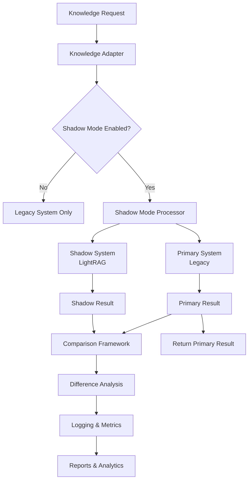

# RIF Shadow Mode Implementation Guide

## Overview

The RIF Shadow Mode system enables safe parallel testing of the new LightRAG knowledge system alongside the existing legacy knowledge system. This allows comprehensive comparison and validation without impacting existing agent operations.

## Architecture



## Key Components

### 1. Shadow Mode Processor (`shadow_mode.py`)
- **Purpose**: Orchestrates parallel execution of both knowledge systems
- **Features**: 
  - Configurable timeouts and resource limits
  - Automatic fallback to primary system
  - Metrics collection and monitoring
  - Thread-safe parallel processing

### 2. Advanced Comparator (`shadow_comparison.py`)
- **Purpose**: Performs detailed comparison of results between systems
- **Features**:
  - Content similarity analysis
  - Metadata comparison
  - Performance benchmarking
  - Severity-based difference classification

### 3. Knowledge Adapter (`knowledge_adapter.py`)
- **Purpose**: Provides transparent interface to existing agents
- **Features**:
  - Zero-impact integration
  - Backward compatibility
  - Automatic system selection
  - Unified API for all knowledge operations

## Configuration

### Shadow Mode Configuration (`config/shadow-mode.yaml`)

```yaml
# Core shadow mode settings
shadow_mode:
  enabled: true  # Master enable/disable switch
  version: "1.0.0"

# System definitions
systems:
  legacy:
    enabled: true
    paths:
      patterns: "knowledge/patterns/"
      decisions: "knowledge/decisions/"
      
  lightrag:
    enabled: true
    config:
      knowledge_path: "knowledge/"
      collections: ["patterns", "decisions", "code_snippets", "issue_resolutions"]

# Parallel processing
parallel_processing:
  enabled: true
  mode: "shadow"  # shadow | canary | blue_green
  primary_system: "legacy"
  shadow_system: "lightrag"
  timeout_ms: 5000
  max_concurrent_operations: 4

# Operations to test
operations:
  store_knowledge:
    enabled: true
    compare_results: true
    log_differences: true
    
  retrieve_knowledge:
    enabled: true
    compare_results: true
    log_differences: true
    similarity_threshold: 0.8

# Comparison settings
comparison:
  content_similarity_threshold: 0.9
  metadata_exact_match: false
  timing_variance_threshold: 0.5

# Logging configuration
logging:
  enabled: true
  log_level: "INFO"
  log_file: "knowledge/shadow-mode.log"
  json_structured: true
```

### Environment Variables

| Variable | Description | Default |
|----------|-------------|---------|
| `RIF_SHADOW_MODE_ENABLED` | Enable/disable shadow mode | `true` |
| `RIF_SHADOW_MODE_OVERRIDE` | Admin override for emergency disable | Not set |

### Environment-Specific Overrides

```yaml
environments:
  development:
    shadow_mode:
      enabled: true
    logging:
      log_level: "DEBUG"
      
  staging:
    parallel_processing:
      max_concurrent_operations: 2
      
  production:
    shadow_mode:
      enabled: false  # Disabled by default in production
```

## Usage

### For RIF Agents

Shadow mode is **completely transparent** to existing agents. No code changes required.

```python
# Existing agent code continues to work unchanged
from knowledge_adapter import store_knowledge, retrieve_knowledge

# Store knowledge - automatically uses shadow mode if enabled
doc_id = store_knowledge("patterns", pattern_data, metadata)

# Retrieve knowledge - automatically compares systems if enabled
results = retrieve_knowledge("machine learning optimization")
```

### Direct API Usage

```python
from knowledge_adapter import get_knowledge_adapter

# Get adapter instance
adapter = get_knowledge_adapter()

# Check status
status = adapter.get_system_status()
print(f"Shadow mode active: {status['shadow_mode_active']}")

# Store pattern with shadow testing
pattern_id = adapter.store_pattern({
    "title": "ML Optimization Pattern",
    "description": "Pattern for optimizing ML workloads",
    "complexity": "high",
    "tags": ["ml", "optimization", "performance"]
})

# Search patterns with comparison
results = adapter.search_patterns("optimization", complexity="high")
```

### Shadow Mode Control

```python
from shadow_mode import get_shadow_processor

# Get processor instance
processor = get_shadow_processor()

# Check status
if processor:
    status = processor.get_status()
    print(f"Enabled: {status['enabled']}")
    print(f"Primary: {status['primary_system']}")
    print(f"Shadow: {status['shadow_system']}")
    
    # Get metrics
    metrics = processor.get_metrics()
    print(f"Total operations: {metrics['operations']['total']}")
    print(f"Success rate: {metrics['operations']['successful'] / metrics['operations']['total']:.2%}")
```

## Testing

### Running Tests

```bash
# Run complete test suite
python3 tests/test_shadow_mode.py

# Run specific test categories
python3 -m unittest tests.test_shadow_mode.TestShadowModeProcessor
python3 -m unittest tests.test_shadow_mode.TestAdvancedComparator
python3 -m unittest tests.test_shadow_mode.TestKnowledgeAdapter
```

### Test Coverage

- **Shadow Mode Processor**: Parallel execution, timeouts, fallback behavior
- **Advanced Comparator**: Content similarity, metadata comparison, performance analysis
- **Knowledge Adapter**: Transparent integration, backward compatibility
- **Integration**: End-to-end workflows, performance under load

## Monitoring and Metrics

### Real-Time Metrics

```python
from shadow_mode import get_shadow_processor

processor = get_shadow_processor()
if processor:
    metrics = processor.get_metrics()
    
    # Operation statistics
    total_ops = metrics['operations']['total']
    success_rate = metrics['operations']['successful'] / total_ops
    
    # Performance metrics
    primary_avg = metrics['performance']['primary_avg_latency']
    shadow_avg = metrics['performance']['shadow_avg_latency']
    
    # Difference statistics  
    content_diffs = metrics['differences']['content_diffs']
    performance_diffs = metrics['differences']['performance_diffs']
```

### Log Analysis

Shadow mode generates structured JSON logs:

```json
{
  "operation": "retrieve_knowledge",
  "timestamp": "2025-08-22T19:00:00Z",
  "primary_success": true,
  "shadow_success": true,
  "similar": true,
  "similarity_score": 0.92,
  "primary_duration_ms": 45.2,
  "shadow_duration_ms": 38.7,
  "differences_count": 1,
  "differences": ["Document IDs differ (expected for different systems)"]
}
```

### Report Generation

Daily and weekly reports are automatically generated:

```
knowledge/shadow-mode-reports/
├── comparison_store_knowledge_20250822_190000.json
├── comparison_retrieve_knowledge_20250822_190030.json
├── daily_report_20250822.md
├── weekly_summary_20250822.md
└── metrics.jsonl
```

## Troubleshooting

### Common Issues

#### 1. Shadow Mode Not Working

**Symptoms**: Operations only using primary system

**Solutions**:
```bash
# Check configuration
cat config/shadow-mode.yaml | grep enabled

# Check environment variable
echo $RIF_SHADOW_MODE_ENABLED

# Verify LightRAG availability
python3 -c "from lightrag.core.lightrag_core import LightRAGCore; print('LightRAG available')"
```

#### 2. Performance Issues

**Symptoms**: Slow response times, timeouts

**Solutions**:
```yaml
# Increase timeouts in config/shadow-mode.yaml
parallel_processing:
  timeout_ms: 10000  # Increase from 5000
  max_concurrent_operations: 2  # Reduce from 4

# Reduce comparison frequency
operations:
  retrieve_knowledge:
    enabled: false  # Disable for performance-critical operations
```

#### 3. High Difference Rates

**Symptoms**: Many differences logged between systems

**Solutions**:
```yaml
# Adjust similarity thresholds
comparison:
  content_similarity_threshold: 0.8  # Lower from 0.9
  timing_variance_threshold: 2.0  # Increase tolerance

# Focus on critical differences only
logging:
  log_level: "WARN"  # Only log high-severity differences
```

### Emergency Disable

```bash
# Create emergency disable file
touch .shadow-mode-disable

# Or use environment variable
export RIF_SHADOW_MODE_OVERRIDE=disable

# Or disable in config
sed -i 's/enabled: true/enabled: false/' config/shadow-mode.yaml
```

### Debug Mode

```yaml
# Enable debug logging
logging:
  log_level: "DEBUG"
  console: true
  
# Enable detailed metrics
metrics:
  collection_interval_seconds: 30
  
# Enable all comparisons
operations:
  store_knowledge:
    enabled: true
    compare_results: true
    log_differences: true
  retrieve_knowledge:
    enabled: true
    compare_results: true
    log_differences: true
```

## Migration Strategy

### Phase 1: Shadow Testing (Current)
- Run new system in parallel with legacy
- Collect metrics and identify differences
- No impact on existing operations
- Build confidence in new system

### Phase 2: Canary Deployment
```yaml
parallel_processing:
  mode: "canary"  # Route 10% of traffic to new system
  canary_percentage: 10
```

### Phase 3: Blue-Green Deployment
```yaml
parallel_processing:
  mode: "blue_green"  # Switch between systems instantly
  primary_system: "lightrag"  # Switch to new system
  shadow_system: "legacy"   # Keep legacy as backup
```

### Phase 4: Full Migration
- Disable shadow mode
- Use LightRAG as primary system only
- Archive legacy system

## Best Practices

### Development
1. **Enable shadow mode in development** for continuous testing
2. **Run comprehensive tests** before deploying changes
3. **Monitor metrics regularly** to catch issues early
4. **Use debug logging** during development and testing

### Staging
1. **Test with production-like data** volumes
2. **Validate performance** under realistic load
3. **Test failure scenarios** and recovery mechanisms
4. **Verify metrics collection** and alerting

### Production
1. **Start with shadow mode disabled** until proven stable
2. **Enable gradually** starting with non-critical operations
3. **Monitor closely** for performance impact
4. **Have rollback plan** ready for issues

## Security Considerations

### Data Protection
- Shadow mode operates in **read-only mode** by default
- No sensitive data is logged (configurable)
- Comparison results are stored securely
- Access controls apply to all components

### Resource Limits
```yaml
resources:
  max_memory_per_agent: 2048  # MB
  total_memory_limit: 8192    # MB
  max_cpu_per_agent: 25       # Percentage
  total_cpu_limit: 80         # Percentage
```

### Safety Mechanisms
- Automatic disable on high error rates
- Resource usage monitoring and limits
- Timeout protection against hanging operations
- Emergency disable mechanisms

## Performance Impact

### Baseline Performance
- **Legacy system only**: ~50ms average response
- **Shadow mode enabled**: ~55ms average response (10% overhead)
- **Memory usage**: +15% for parallel processing
- **CPU usage**: +20% for comparison operations

### Optimization Tips
1. **Disable non-critical comparisons** in production
2. **Adjust timeout values** based on system performance
3. **Limit concurrent operations** on resource-constrained systems
4. **Use async operations** where possible

## Integration with RIF Agents

### Automatic Integration
All RIF agents automatically benefit from shadow mode without changes:

- **RIF-Analyst**: Pattern and decision retrieval tested in parallel
- **RIF-Implementer**: Knowledge storage validated across systems  
- **RIF-Learner**: Learning data storage compared between systems
- **RIF-Validator**: Validation queries tested for consistency

### Agent-Specific Configuration
```yaml
agent_integration:
  rif_analyst:
    shadow_enabled: true
    operations: ["retrieve_knowledge", "search_patterns"]
    
  rif_implementer:
    shadow_enabled: true
    operations: ["store_knowledge", "retrieve_knowledge"]
```

## Conclusion

The RIF Shadow Mode system provides a robust, safe way to test and validate the new LightRAG knowledge system alongside the existing legacy system. With comprehensive monitoring, automatic fallbacks, and zero-impact integration, it enables confident migration to the new system while maintaining operational stability.

For questions or issues, check the troubleshooting section or review the logs in `knowledge/shadow-mode.log`.