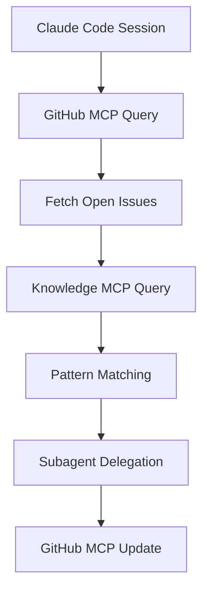
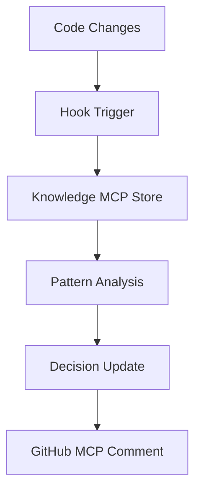

# MCP Server Integration Patterns for RIF

## Overview

Based on official Claude Code documentation, MCP (Model Context Protocol) servers are the primary method for extending Claude Code's capabilities. This document outlines how RIF can leverage MCP servers for GitHub integration and workflow automation.

## What MCP Servers Actually Are

### Core Definition
- **Open-source standard** for AI-tool integrations
- Enable Claude Code to connect with external tools, databases, and APIs
- Provide **real-time access** to various services and data sources

### Key Capabilities
- Implement features from issue trackers (GitHub, Jira, etc.)
- Analyze monitoring data
- Query databases
- Integrate designs
- Automate workflows

## Installation Methods

### 1. Local stdio Servers
```bash
# Example: Install Airtable MCP server locally
claude mcp add airtable --env AIRTABLE_API_KEY=YOUR_KEY -- npx -y airtable-mcp-server
```

**Characteristics**:
- Run as local processes
- Ideal for tools needing direct system access
- Full control over server configuration

### 2. Remote SSE Servers
```bash
# Example: Install Linear MCP server via SSE
claude mcp add --transport sse linear https://mcp.linear.app/sse
```

**Characteristics**:
- Server-Sent Events for real-time streaming
- Suitable for live data feeds
- Reduced local resource usage

### 3. Remote HTTP Servers
```bash
# Example: Install Notion MCP server via HTTP
claude mcp add --transport http notion https://mcp.notion.com/mcp
```

**Characteristics**:
- Standard request/response patterns
- Stateless interactions
- Easiest to implement and debug

## Configuration Scopes

### Local Scope
- **Use case**: Personal, project-specific servers
- **Access**: Current project only
- **Configuration**: Project-level settings

### Project Scope
- **Use case**: Team-shared configurations
- **Access**: All team members in project
- **Configuration**: Committed to repository

### User Scope
- **Use case**: Cross-project accessible servers
- **Access**: All projects for user
- **Configuration**: User profile settings

## GitHub Integration Patterns

### Pattern 1: GitHub MCP Server (Recommended)
```bash
# Install GitHub MCP server
claude mcp add --transport http github https://api.github.com/mcp
```

**Capabilities**:
- Read/write issues
- Manage labels and milestones
- Create/update pull requests
- Access repository metadata
- Webhook integration

### Pattern 2: Local GitHub CLI Integration
```bash
# Create local MCP server wrapping GitHub CLI
claude mcp add github-cli --stdio -- gh-mcp-server
```

**Capabilities**:
- Leverage existing `gh` CLI authentication
- Full GitHub API access through CLI
- Local configuration and caching

### Pattern 3: Custom GitHub MCP Server
```bash
# Deploy custom MCP server for RIF-specific operations
claude mcp add rif-github --transport http -- http://localhost:3000/mcp
```

**Custom Features**:
- RIF-specific issue state management
- Specialized workflow automation
- Custom label and milestone logic
- Integration with RIF knowledge base

## RIF-Specific MCP Integration Architecture

### Recommended MCP Server Stack for RIF

1. **GitHub Integration Server**
   - Purpose: Issue management, PR creation, label handling
   - Type: HTTP or Local stdio
   - Priority: Critical

2. **Knowledge Base Server**
   - Purpose: Query patterns, decisions, metrics
   - Type: Local stdio (for performance)
   - Priority: High

3. **Development Tools Server**
   - Purpose: Testing, building, quality checks
   - Type: Local stdio
   - Priority: Medium

4. **Monitoring Server**
   - Purpose: Error tracking, performance metrics
   - Type: Remote SSE (for real-time)
   - Priority: Low

### MCP-Based Workflow Patterns

#### Issue Processing Workflow


#### Knowledge Management Workflow


## Authentication and Security

### OAuth 2.0 Integration
```bash
# GitHub OAuth setup
claude mcp add github --env GITHUB_CLIENT_ID=xxx --env GITHUB_CLIENT_SECRET=yyy --oauth
```

### Environment Variables
```bash
# Secure credential management
claude mcp add github --env GITHUB_TOKEN=$(cat ~/.github-token)
```

### Permission Scopes
- **Read access**: Issues, repositories, metadata
- **Write access**: Issues, labels, comments, PRs
- **Admin access**: Webhooks, repository settings (if needed)

## Implementation Examples

### Basic GitHub Issue Query
```javascript
// MCP server endpoint: /issues/list
{
  "method": "issues.list",
  "params": {
    "state": "open",
    "labels": ["state:new", "state:implementing"],
    "sort": "created",
    "direction": "desc"
  }
}
```

### RIF State Transition
```javascript
// MCP server endpoint: /issues/update
{
  "method": "issues.update",
  "params": {
    "issue_number": 123,
    "labels": {
      "remove": ["state:new"],
      "add": ["state:implementing", "agent:rif-implementer"]
    },
    "assignee": "rif-system"
  }
}
```

### Knowledge Base Integration
```javascript
// MCP server endpoint: /knowledge/query
{
  "method": "knowledge.query", 
  "params": {
    "type": "similar_issues",
    "query": "implement user authentication",
    "limit": 5,
    "threshold": 0.7
  }
}
```

## Migration Strategy from Current RIF

### Phase 1: Replace Task Orchestration
- **Remove**: Task-based agent launching
- **Replace**: MCP server queries + subagent delegation
- **Timeline**: Immediate

### Phase 2: Implement GitHub MCP
- **Add**: GitHub MCP server configuration
- **Update**: All GitHub interactions to use MCP
- **Timeline**: Short-term

### Phase 3: Knowledge Base MCP
- **Add**: Local knowledge base MCP server
- **Migrate**: Pattern queries to MCP
- **Timeline**: Medium-term

### Phase 4: Full Integration
- **Complete**: All external interactions via MCP
- **Optimize**: Performance and reliability
- **Timeline**: Long-term

## Best Practices

### Server Selection
1. **Use local stdio** for performance-critical operations
2. **Use remote HTTP** for stateless operations  
3. **Use remote SSE** for real-time data feeds

### Error Handling
1. **Graceful degradation** when MCP servers unavailable
2. **Retry logic** for transient failures
3. **Fallback mechanisms** for critical operations

### Performance
1. **Cache frequent queries** locally
2. **Batch operations** where possible
3. **Use appropriate timeouts** for different server types

### Security
1. **Verify server certificates** for remote servers
2. **Use environment variables** for credentials
3. **Limit scope** of permissions granted
4. **Regular credential rotation**

## Testing MCP Integration

### Local Development
```bash
# Test MCP server connectivity
claude mcp list
claude mcp test github
```

### Integration Testing
```bash
# Validate GitHub operations
claude mcp exec github issues.list
claude mcp exec github issues.create --title "Test Issue"
```

### Performance Testing
```bash
# Benchmark MCP response times
time claude mcp exec github issues.list --count 100
```

## Troubleshooting

### Common Issues
1. **Authentication failures**: Check credentials and OAuth setup
2. **Connection timeouts**: Verify network and server availability
3. **Permission denied**: Review API scopes and access levels
4. **Rate limiting**: Implement backoff and retry logic

### Debug Tools
```bash
# Enable MCP debug logging
claude mcp debug --enable
claude mcp logs github

# Test specific MCP endpoints
claude mcp test --endpoint /issues/list --params '{"state":"open"}'
```

---

*This document provides the foundation for migrating RIF from Task-based orchestration to MCP-based integration.*